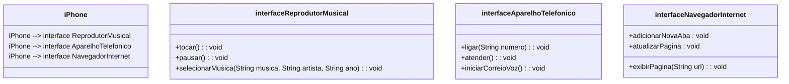

## Santander 2024 - Backend with Java

### Diagrama UML (Mermaid)

```mermaid
classDiagram

    class iPhone {
    iPhone --> interface ReprodutorMusical
    iPhone --> interface AparelhoTelefonico 
    iPhone --> interface NavegadorInternet 
 }
        class interface ReprodutorMusical {
        +tocar() : void
        +pausar() : void
        +selecionarMusica(String musica, String artista, String ano) : void
        }
        class interface AparelhoTelefonico {
        +ligar(String numero) : void
        +atender() : void
        +iniciarCorreioVoz() : void
        }
        class interface NavegadorInternet {
        +exibirPagina(String url) : void
        +adicionarNovaAba : void
        +atualizarPagina : void
        }

 
```
